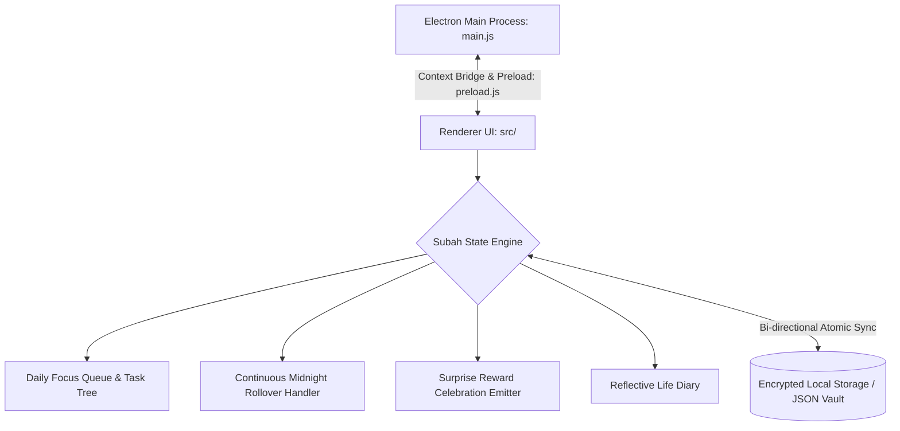

# 🌅 Subah — Daily Focus & Gamified Task Book

<div align="center">

[](LICENSE)
[](https://www.electronjs.org/)
[](https://github.com/Kamran5H/Subah-TaskBook)
[](https://github.com/Kamran5H/Subah-TaskBook)
[](https://github.com/Kamran5H/Subah-TaskBook)

**A distraction-free, offline-first daily focus console, personal life diary, and continuous rollover task book with gamified surprise rewards.**

[Philosophy](#-philosophy) • [Key Features](#-key-features) • [Architecture](#-architecture) • [Quickstart](#-quick-start) • [License](#-license)

</div>

---

## 🌟 Philosophy

Most modern task managers fail because they create anxiety: rigid deadlines turn into overdue notifications, guilt piles up, and users abandon the app.

**Subah** (meaning *"Morning"* in Urdu/Arabic) is designed around compassion, focus, and organic flow. It embraces the reality of daily life:
- **Continuous Rollover**: Uncompleted tasks from yesterday do not turn red or trigger shame—they gracefully carry forward into today's focus queue.
- **Surprise Rewards**: Completing high-effort focus sessions triggers delightful, randomized gamified micro-celebrations and philosophical reflections.
- **Life Diary Synthesis**: Seamlessly blends tactical daily checklists with a personal evening reflective journal.

---

## 🚀 Key Features

- **🎯 Anchor Focus Mode**: Pin your #1 highest-priority task to the top of the interface, hiding distraction vectors until that objective is achieved.
- **🔄 Frictionless Continuous Rollover**: Automatically migrates pending backlog items at midnight without cluttering your inbox or resetting streaks.
- **🎉 Surprise Reward Engine**: Completing tasks triggers procedural confetti animations, motivational milestone badges, and surprise reward cards.
- **🔒 100% Local & Sovereign**: Zero cloud accounts, zero tracking, and zero subscription paywalls. All task data and journal entries are encrypted and stored locally.
- **📖 Integrated Life Diary**: Dedicated evening reflection mode to record gratitude, lessons learned, and breakthroughs.
- **⚡ Lightweight Desktop Performance**: Zero idle CPU consumption with instant keyboard shortcuts (`Ctrl+N` new task, `Ctrl+D` toggle done).

---

## 🏗️ Architecture



---

## 📁 Repository Structure

```text
Subah-TaskBook/
├── main.js                     # Electron main process entry point
├── preload.js                  # IPC security bridge and safe API exposure
├── package.json                # Project dependencies and packaging scripts
├── src/                        # Frontend UI components, styling & audio effects
├── assets/                     # Application icons, celebration graphics & soundbites
├── scripts/                    # Build and distribution utilities
├── test/                       # Unit tests & rollover validation suite
├── .gitignore                  # Node modules & build exclusions
└── LICENSE                     # Open-source MIT License
```

---

## ⚡ Quick Start

### Prerequisites
- Node.js 18.0+ or higher
- npm / yarn

### Installation
```bash
git clone https://github.com/Kamran5H/Subah-TaskBook.git
cd Subah-TaskBook

# Install dependencies
npm install

# Launch Subah desktop app
npm start
```

---

## 📜 License

This project is open-source and released under the [MIT License](LICENSE).  
Copyright (c) 2024-2026 **Kamran Ashraf**.
