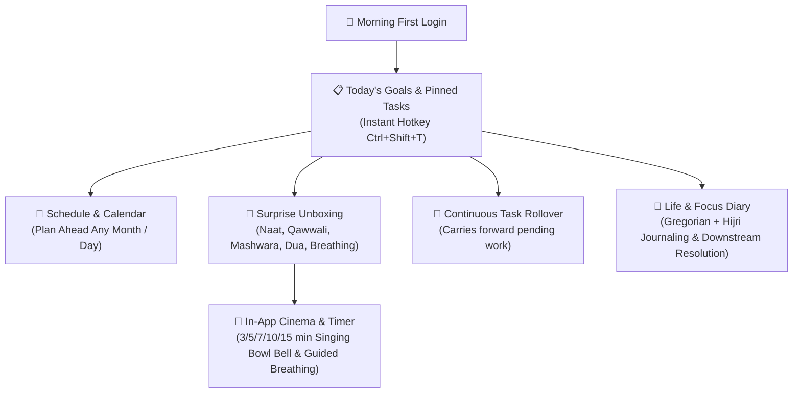

# 🌅 Subah — Daily Focus & Surprise Reward Book

<div align="center">


**A high-performance, distraction-free desktop application engineered for daily discipline, intentional focus, spiritual reflection, and celebratory accomplishment.**

</div>

---

## 🌟 Executive Overview

**Subah (صبح)** is an artisanal productivity environment designed to turn every morning into an intentional, high-momentum launchpad. Unlike standard to-do lists that create anxiety or get ignored, Subah combines **an unlocked, responsive daily checklist**, **pinned tasks and priority cycling**, **a full interactive month schedule and calendar**, **autonomous pending task rollover**, **an interactive Life & Focus Diary with dual Gregorian/Hijri tracking**, and **delightful 5–10 minute celebratory rewards** (soulful naats, legendary qawwalis, serene melodies, guided box breathing, and practical daily wisdom).

Crafted with pure vanilla ES6 and Electron 34, Subah delivers instant startup times and zero runtime npm bloat.

---

## ✨ Core Pillars & Feature Architecture



### 1. 📋 Today's Goals & Task Checklist
- **Fast Flexible Goal Adding**: Add goals with zero artificial friction or locking barriers.
- **📌 Priority Pinning**: Pin crucial goals to stay at the absolute top of your day.
- **Priority Cycling**: One-click cycle between `High 🔥`, `Normal`, and `Low` priority.
- **Inline Editing & Quick Defer**: Double-click any task to edit inline, or click defer to move it cleanly to tomorrow.

### 2. 📅 Interactive Schedule & Month Calendar
- **Full Interactive Calendar Grid**: View any month, click any day to inspect and plan tasks in advance.
- **Task Indicator Dots**: Gold dots for pinned tasks, cyan for pending, emerald for completed.
- **Quick Preset Chips**: Jump instantly to `Today`, `+1 Tomorrow`, `+3 Days`, `+1 Week`, or pick any date directly.
- **Move to Today (☀️)**: Relocate any future or past scheduled task directly to today's goals with one click.

### 3. 🔄 Continuous Autonomous Task Rollover Series
- **Never Lose Unfinished Goals**: Any task left uncompleted at midnight automatically chains forward to the next active day.
- **Origin Date Tracing**: Carried-over tasks maintain an origin tag (e.g. `🔄 Carried from 2026-09-08`), giving you clear historical perspective without cluttering today's view.
- **Downstream Completion Synchronization**: Checking off a carried task in the diary or schedule instantly updates historical completion analytics.

### 4. 📖 Interactive Life & Focus Diary
- **Dual Calendar Header**: Full support for standard Gregorian dates alongside traditional Hijri Islamic dating (e.g. *Rab. I 27, 1448 AH*).
- **Retroactive Progress & Notes**: Review past days with live interactive checkboxes, completion percentages, and daily reflection gratitude journals.
- **Downstream Resolution Engine**: Tasks carried forward and completed later reflect accurately as completed.
- **Instant Search & Highlighting**: Fast search across tasks, tags, dates, and priorities with real-time mark highlighting.
- **Markdown Export**: Export any single day's journal or the entire multi-year archive into portable Markdown.

### 5. 🎁 Celebratory Rewards, Zen Cinema & Guided Breathing
When you check off a task, Subah rewards your momentum with celebratory fanfare:
- **Acoustic Fanfare & Confetti**: Radiant particle physics celebration upon task completion.
- **3D Surprise Gift Unboxing**: Reveals a curated 5–10 minute break item from 8 distinct collections (53 items):
  - 🕌 **Soulful Naat**: Timeless classics (*Faslon Ko Takalluf*, *Qasida Burda*, *Mustafa Jaan-e-Rehmat*, *Karam Mangta Hoon*, *Main Tou Panjtan Ka Ghulam Hoon*).
  - 🎶 **Legendary Qawwali**: Deep Sufi musical traditions (*Tajdar-e-Haram*, *Chaap Tilak*, *Dam Mast Qalandar*, *Woh Hata Rahe Hain Parda*, *Allah Hoo*).
  - 🎵 **Soulful Melodies**: Turkish Ney Flute, bamboo meditations, and gentle acoustic rain.
  - 💡 **Daily Mashwara (Wisdom)**: Practical life principles on Barakah, overcoming procrastination, and consistency.
  - 📖 **Thoughts to Ponder**: Uplifting reflections and timeless insights.
  - 🤲 **Dua & Zikr**: Ayat al-Kursi, Dua Yunus, Istighfar, Hasbunallah, Salawat.
  - 🌬️ **Breathe & Move**: Guided 4-phase box breathing visualizer, physiological sigh, and movement resets.
  - 📱 **Mindful Reels**: Visual sparks of motivation.
- **Embedded Cinema Player**: Built-in YouTube player served over a local loopback HTTP origin (`127.0.0.1`) with automatic embed error detection and search fallbacks.
- **Guided Box Breathing**: Interactive glowing orb guides 4s inhale, 4s hold, 4s exhale, 4s hold.
- **Singing Bowl Break Timer**: Choose 3, 5, 7, 10, or 15 minutes; a soothing Tibetan singing bowl bell chimes when it's time to return.

### 6. 🎨 Handcrafted Glassmorphism Themes
- **Midnight Aurora**: Deep obsidian indigo with glowing cyan/purple aurora accents and frosted backdrop filters.
- **Royal Emerald & Gold**: Luxurious deep forest emerald velvet paired with regal warm gold highlights.
- **Obsidian OLED**: Absolute pitch-black contrast optimized for OLED displays and late-night sessions.

---

## ⌨️ Shortcuts & Hotkeys

| Shortcut | Scope | Action |
| :--- | :--- | :--- |
| **`Ctrl + Shift + T`** | Windows Global | Summon / Minimize Subah instantly from anywhere |
| **`Enter`** | Task Input | Rapidly add new task card |
| **`Ctrl + Enter`** | Brain Dump | Submit and parse journal dump |
| **`Esc`** | Modal Dialogs | Dismiss preview / unboxing dialog |

---

## 🛠️ Tech Stack & Architecture

- **Shell**: Electron 34.2.0 (Windows x64).
- **Frontend Architecture**: Pure Vanilla HTML5, CSS3 Glassmorphism tokens, and ES6 Modules.
- **Dependencies**: **0 Runtime Dependencies** (Only Electron in `devDependencies`).
- **Data Persistence**: Atomic, corruption-resistant JSON engine with rolling historical backups in `%APPDATA%\subah-taskbook\`.
- **Loopback Origin**: Internal Node.js HTTP server on loopback interface (`127.0.0.1`) ensures smooth YouTube iframe embedding and prevents CORS issues.
- **Testing**: Comprehensive 17-point test harness (`npm test`) validating streak calculations, task rollover series, UI contracts, and media endpoint durability.

---

## 🚀 Installation & Developer Setup

### Prerequisites
- [Node.js](https://nodejs.org/) (v18 or higher recommended)
- Windows 10 or Windows 11

### 1. Clone & Install
```bash
git clone https://github.com/Kamran5H/Subah-TaskBook.git
cd Subah-TaskBook
npm install
```

### 2. Run Test Suite
```bash
npm test
```

### 3. Launch Development Instance
```bash
npm start
```

### 4. Build Standalone Production Executable
```bash
npm run package
```
Generates the portable binary inside `dist/Subah-win32-x64/Subah.exe`.

---

## 👤 Author & Credits

- **Developer & Architect**: [Kamran Ashraf (@Kamran5H)](https://github.com/Kamran5H)
- **Design Signature**: Golden developer attribution integrated into settings and footer.
- **License**: Released under the [MIT License](LICENSE).
