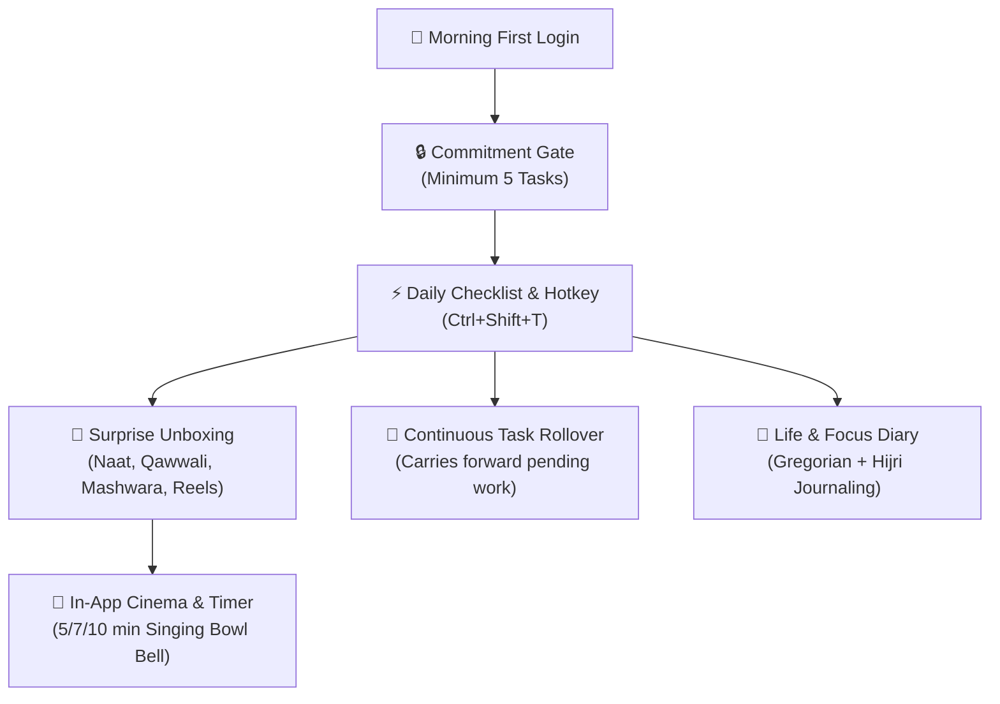

# 🌅 Subah — Daily Focus & Surprise Reward Book

<div align="center">


**A high-performance, distraction-free desktop application engineered for daily discipline, intentional focus, spiritual reflection, and celebratory accomplishment.**

</div>

---

## 🌟 Executive Overview

**Subah (صبح)** is an artisanal productivity environment designed to turn every morning into an intentional, high-momentum launchpad. Unlike standard to-do lists that create anxiety or get ignored, Subah combines **gentle morning commitment locking**, **autonomous pending task rollover**, **an interactive Life & Focus Diary with dual Gregorian/Hijri tracking**, and **delightful 5–10 minute celebratory rewards** (soulful naats, legendary qawwalis, serene melodies, and practical daily wisdom).

Crafted with pure vanilla ES6 and Electron 34, Subah delivers instant startup times and zero runtime npm bloat.

---

## ✨ Core Pillars & Feature Architecture



### 1. 🔒 Morning Focus Gate (Commitment Lock)
- **Zero-Distraction Morning Shield**: On your first laptop login of the day, Subah greets you with a distraction-free window that cannot be dismissed until you commit your daily roadmap.
- **Minimum 5 Tasks Threshold**: Unlocks dynamic, glowing state indicators once you enter 5 meaningful goals (supports 5, 10, 20+ with zero artificial limits).
- **Dual Input Modalities**:
  - **Fast Brain Dump (Journal Pad)**: Paste or type free-form bullet points or numbered lists; Subah intelligently cleans, parses, and converts each line into a prioritized task card.
  - **Precision Task Builder**: Add tasks step-by-step with `High`, `Normal`, and `Low` priority badges.

### 2. 🔄 Continuous Autonomous Task Rollover Series
- **Never Lose Unfinished Goals**: Any task left uncompleted at midnight automatically chains forward to the next active day.
- **Origin Date Tracing**: Carried-over tasks maintain an origin tag (e.g. `From yesterday`), giving you clear historical perspective without cluttering today's view.
- **Downstream Completion Synchronization**: Checking off a carried task instantly updates historical diary completion analytics so past logs remain accurate.

### 3. 📖 Interactive Life & Focus Diary
- **Dual Calendar Header**: Full support for standard Gregorian dates alongside traditional Hijri Islamic dating (e.g. *Rab. I 27, 1448 AH*).
- **Retroactive Progress & Notes**: Review past days with live interactive checkboxes, completion percentages, and reflection notes.
- **Markdown Export**: Export any day's journal and task record to clean, portable Markdown with a single click.
- **Unified Single Master Scroll**: Smooth, sticky navigation toolbar with zero nested scrollbar traps.

### 4. 🎁 Celebratory Rewards & Break Cinema
When you check off a task, Subah rewards your momentum with celebratory fanfare:
- **Acoustic Fanfare & Confetti**: Radiant particle physics celebration upon task completion.
- **3D Surprise Gift Unboxing**: Reveals a curated 5–10 minute break item from 6 distinct collections:
  - 🕌 **Soulful Naat**: Timeless classics (*Faslon Ko Takalluf*, *Qasida Burda*, *Mustafa Jaan-e-Rehmat*, *Karam Mangta Hoon*).
  - 🎶 **Legendary Qawwali**: Deep Sufi musical traditions (*Tajdar-e-Haram*, *Chaap Tilak*, *Dam Mast Qalandar*, *Woh Hata Rahe Hain Parda*).
  - 🎵 **Soulful Melodies**: Turkish Ney, bamboo flute meditations, serene rain acoustic guitars, and lofi serenity.
  - 💡 **Daily Mashwara (Wisdom)**: Practical life advice on Barakah, overcoming procrastination, mental stillness, and consistency.
  - 📖 **Thoughts to Ponder**: Short 3-minute uplifting stories and timeless insights.
  - 📱 **Mindful Reels**: Visual sparks of motivation.
- **Embedded Cinema Player**: Built-in YouTube player served over a local loopback HTTP origin to eliminate `Error 153` playback restrictions.
- **Singing Bowl Break Timer**: Choose a 5, 7, or 10-minute break timer; a soothing Tibetan singing bowl bell chimes when it's time to return to deep work.

### 5. 🎨 Handcrafted Glassmorphism Themes
- **Midnight Aurora**: Deep obsidian indigo with glowing cyan/purple aurora accents and frosted backdrop filters.
- **Royal Emerald & Gold**: Luxurious deep forest emerald velvet paired with regal warm gold highlights.
- **Obsidian OLED**: Absolute pitch-black contrast optimized for OLED displays and late-night sessions.

---

## ⌨️ Shortcuts & Hotkeys

| Shortcut | Scope | Action |
| :--- | :--- | :--- |
| **`Ctrl + Shift + T`** | Windows Global | Summon / Minimize Subah instantly from anywhere |
| **`Enter`** | Task Input | Rapidly add new task card |
| **`Ctrl + Enter`** | Brain Dump | Submit and parse journal dump |
| **`Esc`** | Modal Dialogs | Dismiss preview / unboxing dialog |

---

## 🛠️ Tech Stack & Architecture

- **Shell**: Electron 34.2.0 (Windows x64).
- **Frontend Architecture**: Pure Vanilla HTML5, CSS3 Glassmorphism tokens, and ES6 Modules.
- **Dependencies**: **0 Runtime Dependencies** (Only Electron in `devDependencies`).
- **Data Persistence**: Atomic, corruption-resistant JSON engine with rolling historical backups in `%APPDATA%\subah-taskbook\`.
- **Loopback Origin**: Internal Node.js HTTP server on loopback interface (`127.0.0.1`) ensures smooth YouTube iframe embedding and prevents CORS issues.
- **Testing**: Comprehensive 17-point test harness (`npm test`) validating streak calculations, task rollover series, UI contracts, and media endpoint durability.

---

## 🚀 Installation & Developer Setup

### Prerequisites
- [Node.js](https://nodejs.org/) (v18 or higher recommended)
- Windows 10 or Windows 11

### 1. Clone & Install
```bash
git clone https://github.com/Kamran5H/Subah-TaskBook.git
cd Subah-TaskBook
npm install
```

### 2. Run Test Suite
```bash
npm test
```

### 3. Launch Development Instance
```bash
npm start
```

### 4. Build Standalone Production Executable
```bash
npm run package
```
Generates the portable binary inside `dist/Subah-win32-x64/Subah.exe`.

---

## 👤 Author & Credits

- **Developer & Architect**: [Kamran Ashraf (@Kamran5H)](https://github.com/Kamran5H)
- **Design Signature**: Golden developer attribution integrated into settings and footer.
- **License**: Released under the [MIT License](LICENSE).
